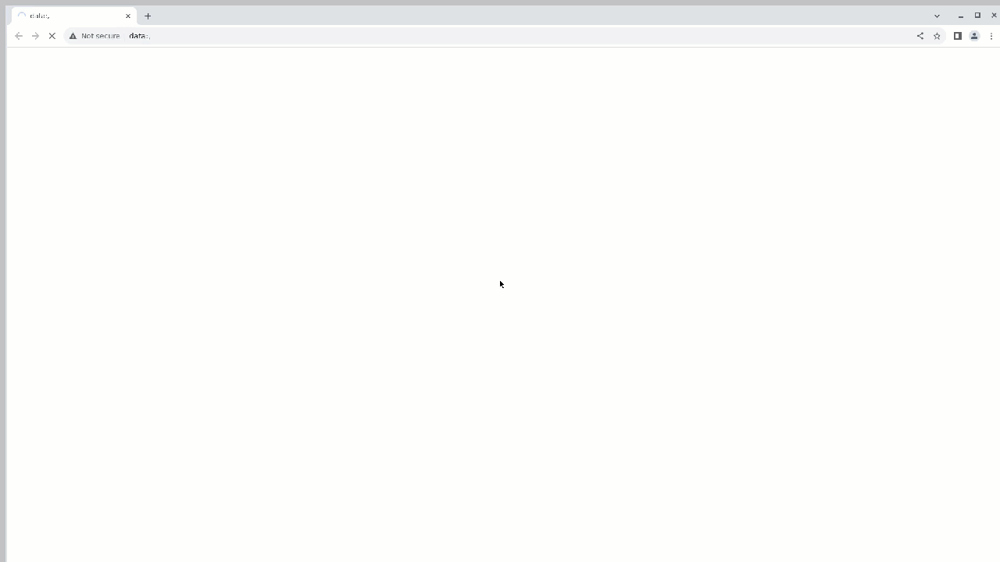

# Домашнее задание к уроку 14 - автоматические тесты для [**x5**](https://www.x5.ru/)


## 	:world_map: Содержание:

- [Используемый стек](#computer-используемый-стек)
- [Описание автотестов](#pushpin-описание-тестов)
- [Запуск автотестов](#arrow_forward-запуск-автотестов)
- [Сборка в Jenkins](#-сборка-в-jenkins)
- [Пример Allure-отчета](#-пример-allure-отчета)
- [Интеграция с Allure TestOps](#-интеграция-с-allure-testops)
- [Интеграция с Jira](#-интеграция-с-jira)
- [Уведомления в Telegram с использованием бота](#-уведомления-в-telegram-с-использованиеум-бота)
- [Видео примера запуска тестов в Selenoid](#видео-примера-запуска-тестов-в-selenoid)

##  :computer: Используемый стек
<p align="center">


</p>

Тесты в данном проекте написаны на языке <code>Java</code> с использованием фреймворка для тестирования [Selenide](https://selenide.org/), сборщик - <code>Gradle</code>. <code>JUnit 5</code> задействован в качестве фреймворка модульного тестирования.
При прогоне тестов для запуска браузеров используется [Selenoid](https://aerokube.com/selenoid/).
Для удаленного запуска реализована джоба в <code>Jenkins</code> с формированием Allure-отчета и отправкой результатов в <code>Telegram</code> при помощи бота.

## :pushpin: Описание тестов:
- [x] *xFiveMainTest - Сьют для главной страницы*
  - *switchLanguageTest() - Тест переключения языка*
  - *howerTabsTest() - Тест неведения мыши на меню*
  - *footerTest() - Тес на наличие всех элементов в футере*
- [x] *xFiveAboutTest - Сьют для страницы Компании*
  - *aboutTest() - Тес на наличие всех элементов на странице*
- [x] *xFiveCareerTest - Сьют для страницы Карьера*
  - *careerTest() - Тес на наличие всех элементов на странице*

Содержание Allure-отчета:
* Шаги теста;
* Скриншот страницы на последнем шаге;
* Page Source (возможность открыть source страницы в новой вкладке и посмотреть причину падения теста);
* Логи браузерной консоли;
* Видео выполнения автотеста.

## :arrow_forward: Запуск автотестов

### Запуск тестов из терминала
Локальный запуск.
Из корневой директории проекта выполнить:
```
gradle clean test  запуск всех тестов
gradle clean main_page  запуск тестов, которые проверяют главную страницу
gradle clean about_page запуск тестов, которые проверяют главную страницу Компания
gradle clean career_page запуск тестов, которые проверяют главную страницу Карьера
```

### Запуск тестов на удаленном браузере
```
clean ${task}
-Dbrowser_size=${browser_size}
-Dstand=${stand}
-Dversion=${version}
-Dbrowser=${browser}
-Dremote_browser=https://user1:1234@${remote_browser}/wd/hub
```
###  Параметры сборки в Jenkins:
- task (набор тестов для запуска)
- stand (адрес основной страницы тестируемого сайта)
- remote_browser (адрес удаленного сервера, на котором будут выполняться тесты)
- browser_size (размер окна браузера, по умолчанию 1920x1080)
- version (версия браузера, по умолчанию 121)
- browser (браузер, по умолчанию chrome)


##  Сборка в Jenkins
Для запуска сборки необходимо перейти в раздел <code>Build with Parameters</code> и нажать кнопку <code>Build</code>.
<p align="center">

</p>

##  Пример Allure-отчета

<p align="center">

</p>


##  Интеграция с Allure TestOps

Выполнена интеграция сборки <code>Jenkins</code> с <code>Allure TestOps</code>.
Результат выполнения автотестов отображается в <code>Allure TestOps</code>
На Dashboard в <code>Allure TestOps</code> отображена статистика пройденных тестов.

<p align="center">

</p>

### Результат выполнения автотеста

<p align="center">

</p>

##  Интеграция с Jira

Реализована интеграция <code>Allure TestOps</code> с <code>Jira</code>, в тикете отображается информация, какие тест-кейсы были написаны в рамках задачи и результат их прогона.

<p align="center">

</p>

##  Уведомления в Telegram с использованием бота

После завершения сборки, бот созданный в <code>Telegram</code>, автоматически обрабатывает и отправляет сообщение с результатом.

<p align="center">

</p>

## Видео примера запуска тестов в Selenoid

К каждому тесту в отчете прилагается видео прогона.
<p align="center">
  
</p>
